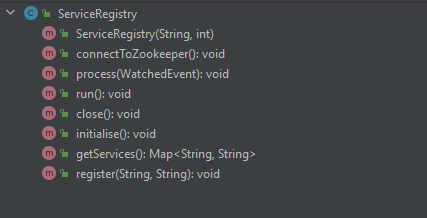

[](https://classroom.github.com/a/_zPlTDO1)


# Distributed Systems Zookeeper Assignment

# Service Registry

## Introduction
Your task is to implement a Service Registry which will use Zookeeper to keep track of which services are present in a distributed cluster. The information it will store will be the names and addresses of each service in the cluster. When new services are added to or removed from the cluster, or the address of a service changes, the service registry should be updated accordingly.

Service Registries are commonly used in distributed computing. In a distributed system, nodes in the system will often need to know which other nodes are in the cluster and how to reach them. This information needs to be kept updated dynamically as nodes join and leave the cluster. For example, in a distributed computation application, the leader node would need to know which worker nodes are available and how they can be reached.

## Services and Cluster Membership
A service is simply a node in the cluster which is identified by name and address. When a new service joins the cluster (i.e. when a new node starts up), it should use the Service Registry to register itself with the cluster, by providing its name and address. The Service Registry should register the new service by creating a new znode in Zookeeper under the `/services` parent znode. The new znode should have the same name as the service name, and should contain the service address as its data. E.g. registering a new service called *service1* at address *host1:1234* should result in the creation of a new znode `/services/service1` which contains `host1:1234` as its data.

The Service Registry should maintain an up-to-date registry of current members of the cluster in the form of a `Map<String, String> {serviceName, serviceAddress}`. Each time a service joins or leaves the cluster this registry should be updated accordingly.

## Service Registry Operation
On startup, the service registry should
- connect to Zookeeper
- check if the `/services` parent znode exists and if it doesn't, create it.
- initialise the registry of services
- watch the cluster to check if services are added or removed, updating the registry accordingly


## Completing the Implementation
You are provided with starter code which includes the classes described below. The [documentation for the Zookeeper Client Java API](https://zookeeper.apache.org/doc/r3.8.0/apidocs/zookeeper-server/org/apache/zookeeper/ZooKeeper.html) will likely be useful to you in completing the implementation.

### `ServiceRegistry.java`
This class is responsible for interacting with Zookeeper to keep the registry of services up-to-date. You are provided with an empty `ServiceRegistry` class. Your task is to complete the implementation of this class. Your class should at a minumum include the **public** methods described below (you're free to write as many additional private methods as you see fit):



- Constructor: `public ServiceRegistry(String zookeeperAddress, int sessionTimeout)`
    - initialises instance variables used to connect to Zookeeper.
- `public void connectToZookeeper()`
    - instantiates a Zookeeper client, creating a connection to the Zookeeper server.
- `public void process(WatchedEvent event)`
    - Handle Zookeeper events related to:
        - Connecting to the Zookeeper server
            - Should print out this message to System.out: `Successfully connected to Zookeeper`
        - Disconnecting from the Zookeeper server
            - Should print out this message to System.out: `Disconnected from Zookeeper`
        - Changes in the services currently present in the cluster (including changes in their addresses)
          - Any changes to the cluster should result in the registry being updated and its contents being printed out.
- `public void run()`
    - Keep the application running waiting for Zookeeper events.
- `public void close()`
    - Close the Zookeeper client connection.
- `public void initialise()`
    - Checks if the `/services` parent znode exists, and create it if it doesn't.
        - Decide for yourself what type of znode it should be (e.g.persistent, ephemeral etc.).
    - Populates the registry with information on the services currently running in the cluster.
    - Output the contents of the registry to the terminal.
- `public Map<String, String> getServices() `
    - Returns the current registry of services in the form of a `Map<String, String>`, where the key is the service name, and the value is the service address.
- `public void register(String serviceName, String serviceAddress)`
  - Allows the service to register with the cluster
  - Creates a znode under the `/services` parent.
  - The name of the created znode should correspond to the `serviceName`
  - The znode should contain the `serviceAddress` as its data
  - Decide for yourself what type of znode it should be (e.g.persistent, ephemeral etc.).

### `Application.java`
This class is partially implemented for you, with some code commented out. It contains a main method which creates a new `ServiceRegistry` instance and calls methods on it to:
- connect to Zookeeper
- initialise the registry
- keep running waiting for Zookeeper events

**You should not make any changes to this class beyond commenting code back in. If there are errors in this class, then the method signatures for `ServiceRegistry` haven't been properly implemented**.


## Building and Running the Service Registry Application
### Building
Use the maven `package` goal from IntelliJ's Maven tool window to build an executable jar from your code. The jar will be called `service-registry-1.0-SNAPSHOT-jar-with-dependencies.jar`and it will be in the `target` folder in your project. Tests have been disabled by default, so as long as your code compiles correctly you can build it into a jar and test it manually by running it (see below). To fully test how your application behaves as part of a cluster this is the recommended approach, i.e. make changes, build, run and see if it behaves as expected.

While developing it may be quicker to run the main method from the IDE to verify standalone operation. The next section describes how this can be done.

### Running
**Ensure that you've started the Zookeeper server first before you run the code**.
To run the application you'll need to provide a service name and service address as command line arguments. You can provide these in the IDE by modifying the run configuration and adding two program arguments, e.g. `service1 host1:1234`. 

To test fully as part of a cluster you'll need to run the jar file on the command line as follows: 
```
java -jar target/service-registry-1.0-SNAPSHOT-jar-with-dependencies.jar service1 host1:1234
```

## Submitting
### Code
**Please ensure that you complete your work in the repository created for you by GitHub Classroom.** To submit, all you need to do is to ensure that you push your code to the repository on GitHub. On the submission date, the most recent commit in the GitHub repository will be treated as your submission. It is not necessary to submit code on Moodle or via email.

### Screencast
As part of the submission, you are required to record a brief (3 - 10 minutes) screencast which includes:
- a demonstration of your solution running
- a walkthrough of your solution code, explaining how it works

Note that you must verbally explain your solution, so you will need your audio on for this screencast.

Use whatever tools you prefer for recording your screencast. You should submit it by uploading to Youtube (as unlisted),
then adding the Youtube link here:

#### Add Link to Screencast Here
https://youtu.be/xoIDEQu7WIo

## Grading
This assignment will be graded in 2 ways:
- Using automated tests on your repository to verify that the expected functionality has been implemented.
- Reviewing your screencast demonstration
- Reviewing your code and examining your repository's commit history to assess:
    - The quality and coding style of your implementation of the functionality.
    - Your adherence to coding best practices regarding formatting, variable naming etc.
    - Your adherence to software development best practices in using git and GitHub.
        - **This means regularly committing your work as you go, using meaningful commit messages**

Marks will be awarded as follows:
- 50% Functionality
- 20% Screencast
- 30% Code Quality

### Autograding Note
Note that the autograding setup is used only as a guide in determining how well your submission meets the requirements. The "points" shown by the autograding tool do not translate directly to grades. You should satisfy yourself that your submission works as expected instead of attempting to write code that just makes the tests pass.

### Compilation
**Submissions that don't compile will be capped at 35%.** Even if your code isn't fully working, make sure that it at least compiles.

## A Note on Comments
There is a spectrum of views on comments. For this course, please **don't** comment everything. I'd like to see comments that are meaningful and useful, which describe some context which isn't obvious from reading the code. I don't want to see pointless comments for the sake of comments which don't provide any useful information and just create clutter. A lot of the simple code you write shouldn't need many comments if it's well-written with sensible variable and method names. Please don't submit code with comments like this:


